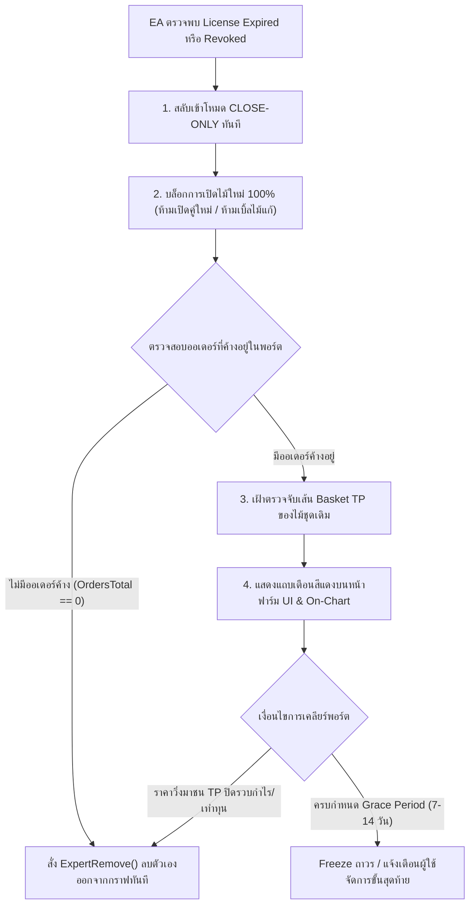

# 🚀 แผนพัฒนา EasyM PRIME: Next-Gen Farm UI & Safe Liquidation Protocol

> **เอกสารข้อกำหนดเชิงเทคนิคและแผนงานพัฒนา (Technical Roadmap & Blueprint)**  
> **เป้าหมาย:** พัฒนาหน้าจอ Farm UI แดชบอร์ดใหม่ ควบคู่กับกลไกความปลอดภัยเมื่อหมดอายุสิทธิ์ **(เฉพาะ EasyM PRIME เท่านั้น)**  
> **เวอร์ชัน:** 2.0.0-PRIME  
> **ปรับปรุงล่าสุด:** ตุลาคม 2026

---

## 📌 สรุปหลักการสำคัญ

1. **หน้าฟาร์ม UI ใหม่ (Prime Command Center):** เปลี่ยนจากแดชบอร์ดดูสถานะอย่างเดียว (Read-Only) เป็นศูนย์ควบคุมและสั่งการ 2 ทิศทาง (Two-Way Interactive Dashboard) รองรับกระดาน 20 คู่เงิน, กองทุนตัดขาดทุนข้ามคู่ (Relief Fund), ระบบกักขัง (Quarantine), และสไนเปอร์ไม้กู้ภัย (Rescue Grid)
2. **ระบบความปลอดภัยเมื่อหมดอายุ (Safe Liquidation Protocol):** บรรจุลงในสถาปัตยกรรม **เฉพาะรุ่น EasyM PRIME เท่านั้น** เพื่อปกป้องเงินทุนลูกค้าเมื่อหมดสัญญาหรือถูกตัดสิทธิ์ โดยระบบจะไม่ทิ้งพอร์ตให้เคว้งคว้าง แต่จะเข้าโหมดปิดรวบอย่างเดียว เมื่อเคลียร์ออเดอร์หมดสิ้นจึงถอดตัวเองออกจากกราฟถาวร

---

## 🛡️ หมวดที่ 1: กลไกความปลอดภัยเมื่อสิทธิ์หมดอายุ (Safe Liquidation Protocol)
*(สำหรับ EasyM PRIME เท่านั้น)*



### 1.1 พฤติกรรมของ EA ฝั่ง MQL5 เมื่อหมดอายุ
1. **บล็อกสัญญาณเปิดไม้ใหม่ทันที (Block Entry Signals):**
   - ห้ามเปิดไม้แรกของคู่เงินใหม่ทุกคู่
   - ห้ามเปิดไม้กริด/ไม้แก้เพิ่ม
2. **รักษาการทำงานของ Basket TP (Take Profit Surveillance):**
   - ระบบยังคงเฝ้าเช็คเส้น Take Profit ของ Basket เดิมที่ค้างอยู่ เมื่อกราฟย่อกลับมาแตะ TP ระบบจะปิดรวบออเดอร์ทั้งหมดทันที
3. **ระยะเวลาผ่อนผัน (Grace Period Window):**
   - กำหนดระยะเวลาเคลียร์พอร์ต 7 – 14 วัน
   - หากพ้นกำหนดแล้วยังไม่ปิด ระบบจะเข้าสู่โหมด Freeze ถาวรและส่ง Alert เตือนเจ้าของพอร์ต
4. **ทำลายตัวเองออกจากกราฟทันทีเมื่อพอร์ตว่าง (Auto-Detached on Clear):**
   - เมื่อจำนวนออเดอร์ทั้งหมดในพอร์ตลดลงเหลือ 0 (`OrdersTotal() == 0`):
     ```mql5
     if(LicenseStatus == LICENSE_EXPIRED && CountActivePrimeOrders() == 0)
     {
         Print(">> [PRIME SECURE] All pending orders closed. Self-removing EA...");
         ExpertRemove(); // ปลดตัวเองออกจากชาร์ตทันที 100% ป้องกันการนำไปรันต่อฟรี
     }
     ```
   - ส่งผลให้ลูกค้า**ไม่สามารถนำ EA ไปรันเทรดต่อได้อีกเลย** หมดข้อกังวลเรื่องการละเมิดลิขสิทธิ์

### 1.2 การแสดงผลบนหน้าฟาร์ม UI เมื่อเข้าโหมด Close-Only
- **Alert Banner ด้านบนสุด:** แสดงแถบสีแดงกระพริบ:
  > `⚠️ สิทธิ์การใช้งาน EasyM PRIME สิ้นสุดลงแล้ว — ระบบกำลังทำงานในโหมด [รอปิดรวบออเดอร์เดิม (Close-Only)] ไม่มีการเปิดไม้ใหม่`
- **ปุ่ม Action:** แสดงปุ่มเด่นชัด **"ต่ออายุการใช้งาน EasyM PRIME"** เพื่อผลักดันให้ลูกค้าต่อสัญญาได้อย่างไร้รอยต่อ

---

## 🧭 หมวดที่ 2: โครงสร้างหน้าจอ Farm UI ใหม่สำหรับ EasyM PRIME

ออกแบบแบ่งเป็น **4 เลเยอร์ (Zones)** ให้ใช้งานง่ายทั้งบนจอมือถือและเดสก์ท็อป:

```text
┌────────────────────────────────────────────────────────────────────────┐
│ ZONE 1: Portfolio Telemetry & Safety Status                           │
│ Balance | Equity | DD% | Today P/L | Port Mode: NORMAL/SLOW/FREEZE     │
│ ⚠️ Worst Pair Monitor: EURJPY (-26.2%)                                  │
├────────────────────────────────────────────────────────────────────────┤
│ ZONE 2: Cross-Pair Relief Fund & Capital Buffer Bar                    │
│ FUND: 73.73 USC  │  CAP: 8,909 USC (5% Bal)  │  USED: 0.00  │ BUF: 1.1x│
├────────────────────────────────────────────────────────────────────────┤
│ ZONE 3: Tactical Threat Radar & Rescue Monitor                         │
│ 🟠 Quarantine (ห้องขัง): [QT: EJ 26.2%] [QT: GJ 24.0%]                 │
│ 🎯 Rescue Grid: R2 Active (DD 2.32%)  │ 🔴 Auto-Hedge: None           │
├────────────────────────────────────────────────────────────────────────┤
│ ZONE 4: 20-Pair Interactive Command Matrix (ตาราง 20 คู่เงิน + สั่งการ)│
│ SYM | RSI Sig | Side | CNT | VU Bar | PNL | Lot | [Close-Only / Action]│
└────────────────────────────────────────────────────────────────────────┘
```

### 2.1 รายละเอียดการแสดงผลทั้ง 4 เลเยอร์
1. **Zone 1: Portfolio Telemetry & Safety Status (สรุปสถานะพอร์ต):**
   - Balance, Equity, Drawdown %, Today P/L, Margin Level
   - **Port Defense Mode:** ไฟสถานะวงกลม `NORMAL` (เขียว) / `SLOW` (ส้ม) / `FREEZE` (ทอง)
   - **Worst Pair Alert:** ปักหมุดคู่ที่ลากพอร์ตหนักสุดทันที
2. **Zone 2: Cross-Pair Relief Fund (กองทุนตัดขาดทุนสำรองข้ามคู่):**
   - แสดง Progress Bar แสดงสัดส่วนเงินกองทุนที่สะสมได้จริง (`FUND`), เพดานกองทุน 5% (`CAP`), ยอดที่เคยนำไปใช้ช่วยตัดขาดทุน (`USED`), และเกราะทุนหนุนหลัง (`BUF`)
3. **Zone 3: Threat Radar (เรดาร์ภัยคุกคาม & กู้ภัย):**
   - **Quarantine Box (ห้องขัง):** แสดงชิปคู่เงินที่ติดลบเดี่ยวแตะ 10% (หยุดถมไม้ รอสไนเปอร์กู้ภัย)
   - **Rescue Active Beacon:** ไฟกะพริบแจ้งเตือนเมื่อไม้กู้ภัยทำงาน เช่น `R2 (2 ไม้ / DD 2.32%)`
   - **Auto-Hedge Shield:** สัญลักษณ์ล็อก Delta=0 ป้องกันพอร์ตแตกเมื่อ DD รวมแตะ 40%
4. **Zone 4: 20-Pair Command Matrix (กระดานควบคุม 20 คู่เงิน):**
   - แสดง 20 คู่เงินพร้อมปุ่มควบคุมแบบ Interactive สามารถแตะเพื่อสั่งงานรายคู่ได้

---

## 🎮 หมวดที่ 3: ปุ่มควบคุมและสั่งการ 2 ทิศทาง (Remote Controls)

| ระดับ | ปุ่มสั่งการ | พฤติกรรมเมื่อกดปุ่ม |
| :--- | :--- | :--- |
| **รายคู่เงิน (Per-Pair)** | **Toggle Close-Only** | สั่งให้คู่เงินนั้นหยุดเปิดไม้ใหม่ เมื่อไม้เดิมปิดทำกำไรจะหยุดการทำงานของคู่นั้นทันที |
| | **Force Quarantine** | สั่งกักขังคู่เงินนั้นด้วยมือทันที (หยุดถมไม้ทันที ไม่ต้องรอให้ DD แตะ 10%) |
| | **Close Pair Basket** | สั่งปิดรวบทุกออเดอร์ของคู่เงินนั้นทันที เพื่อปลด Margin ฉุกเฉิน |
| **ระดับพอร์ต (Global)** | **Force Mode Switch** | สลับโหมดพอร์ตล่วงหน้า เช่น สั่ง `FREEZE` หรือ `SLOW` ก่อนมีข่าวสำคัญ |
| | **Trigger Relief Cut** | สั่งให้นำเงินกองทุนสำรองไปเฉือนตัดขาดทุนไม้ที่ติดลบหนักที่สุดทันที |
| | **Panic Close All** | ปุ่มฉุกเฉินปิดทุกออเดอร์ในพอร์ต (มี Modal ยืนยัน 2 ชั้น) |

---

## 📡 หมวดที่ 4: การปรับโครงสร้างข้อมูล (API & Sync Architecture)

### 4.1 ข้อมูลที่ EA ต้องส่งขึ้นมา (EA ➔ Web Payload)
อัปเกรด JSON Snapshot ให้ส่งออบเจ็กต์ `prime_telemetry` เพิ่มเติม:
```json
{
  "port_number": "21692434",
  "snapshot": { ... },
  "orders": [ ... ],
  "prime_telemetry": {
    "license_state": "ACTIVE",          // ACTIVE, GRACE_PERIOD, EXPIRED_CLOSE_ONLY
    "port_mode": "NORMAL",              // NORMAL, SLOW, FREEZE
    "worst_pair": "EURJPY",
    "worst_pair_dd": 26.23,
    "capital_buffer_pct": 12.5,
    "capital_buffer_mult": 1.1,
    "relief_fund": {
      "balance": 73.73,
      "cap": 8909.00,
      "used": 0.00
    },
    "rescue": {
      "is_active": true,
      "count": 2,
      "dd_pct": 2.32
    },
    "quarantine_pairs": [
      { "symbol": "EURJPY", "dd_pct": 26.23, "orders": 8 }
    ],
    "hedged_pairs": [],
    "pairs_matrix": [
      { "sym": "EURUSD", "status": "ACTIVE", "side": "B", "cnt": 3, "lot": 0.06, "pnl": 12.50, "sig": "B" }
    ],
    "health_alert": "lock withdraws"
  }
}
```

### 4.2 กลไกการส่งคำสั่งจากเว็บไปหา EA (Web ➔ EA Command Queue)
1. เมื่อผู้ใช้กดปุ่มบนหน้าเว็บ ➔ ระบบจะบันทึกคำสั่งลงตาราง `farm_pending_commands` ใน Supabase
2. ในรอบถัดไปที่ EA ส่ง Sync รายวินาที ➔ API Response จะแนบคำสั่งค้างกลับไปให้ EA ทันที:
   ```json
   {
     "success": true,
     "commands": [
       { "id": "cmd_101", "action": "SET_PAIR_MODE", "symbol": "EURUSD", "mode": "CLOSE_ONLY" },
       { "id": "cmd_102", "action": "SET_PORT_MODE", "mode": "FREEZE" }
     ]
   }
   ```
3. EA ทำงานตามคำสั่งเสร็จแล้วจะส่ง `ack_ids: ["cmd_101", "cmd_102"]` ยืนยันกลับมาในรอบถัดไป

---

## 🗓️ แผนงานพัฒนาตามลำดับขั้น (Action Steps)

- [ ] **Step 1:** สร้างตารางฐานข้อมูล `farm_pending_commands` และเพิ่มคอลัมน์ `prime_telemetry` ใน `farm_port_status`
- [ ] **Step 2:** อัปเดตไฟล์ MQL5 (EasyM Prime v2.00) ให้บรรจุลอจิก Safe Liquidation Protocol เมื่อสิทธิ์หมดอายุ
- [ ] **Step 3:** อัปเดตฟังก์ชัน Sync ใน MQL5 ให้แพ็กรวม `prime_telemetry` ส่งขึ้น API และอ่านคำสั่งกลับมา
- [ ] **Step 4:** สร้างหน้า Farm UI Layout ใหม่สำหรับรุ่น PRIME (Responsive 4-Zone Command Center)
- [ ] **Step 5:** ทดสอบการสั่งการแบบจำลอง (Simulation & End-to-End Test)
